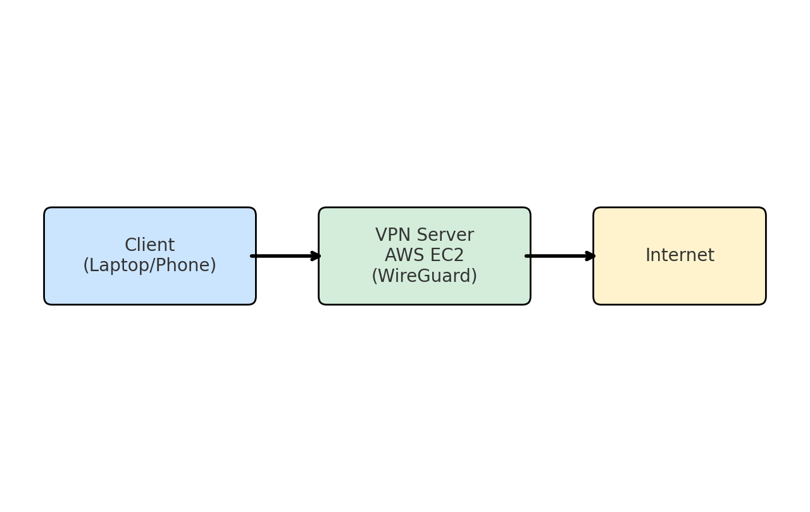
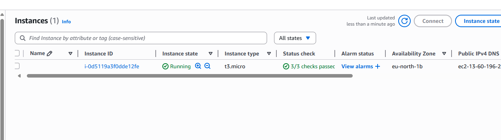
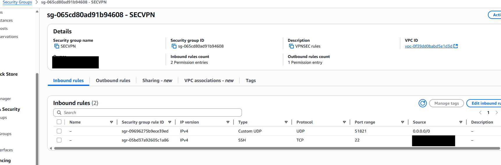
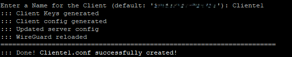
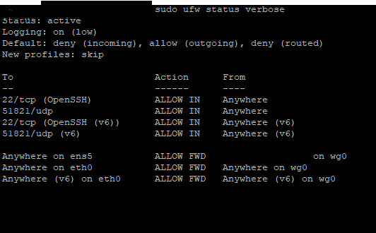
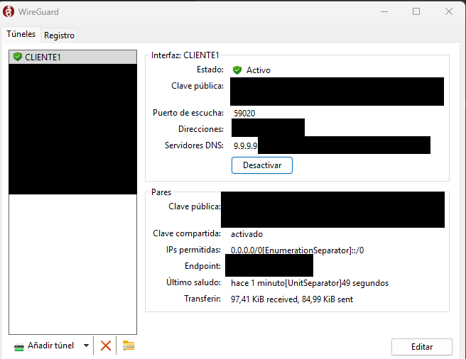

# Secure WireGuard VPN on AWS

This project documents the setup of a hardened VPN server using **WireGuard** and **PiVPN** on an **AWS Free Tier EC2 instance** (Ubuntu 24.04 LTS).

---

## Features

- Encrypted VPN with WireGuard
- Automated installation via PiVPN
- Firewall protection with UFW
- System hardening (SSH key-based login, disabled root login, automatic updates)
- Secure AWS Security Group rules (minimal ports exposed)
- Easy client profile management

---

## Architecture

The setup uses AWS EC2 (t2.micro) as the VPN server. WireGuard tunnels client traffic securely through the server.



---

## Setup Overview

1. **Launch AWS EC2**  
   - Instance type: `t2.micro` (Free Tier eligible)  
   - AMI: Ubuntu 24.04 LTS  
   - Attach Security Group with:
     - TCP 22 (SSH) – restricted to my IP
     - UDP 51821 (WireGuard)

2. **Harden the server**  
   - Disabled password-based SSH login  
   - Disabled root login  
   - Enabled automatic security updates (`unattended-upgrades`)  
   - Configured UFW firewall (allow only SSH and WireGuard)  

3. **Install PiVPN (WireGuard)**  
   - Installed via official PiVPN script  
   - Configured WireGuard on port 51821  
   - Enabled IP forwarding  

4. **Create client profiles**  
   - Used `pivpn add` to generate a client (`Cliente1`)  
   - Exported `.conf` file and QR code for easy mobile import  

5. **Test the connection**  
   - Imported configuration into WireGuard mobile app  
   - Verified connection and external IP via [ifconfig.me](https://ifconfig.me)  

---

## Screenshots

- **AWS EC2 Instance running**  
  

- **Security Group rules**  
  

- **PiVPN client created**  
  

- **UFW firewall status**  
  

- **WireGuard app connected**  
  

---

## Example Client Configuration

> ⚠️ This is only an example. Do not use this configuration in production.  
> Replace keys and IP addresses with your own.

```ini
[Interface]
PrivateKey = <client-private-key>
Address = 10.151.108.2/32
DNS = 1.1.1.1

[Peer]
PublicKey = <server-public-key>
Endpoint = <your-aws-public-ip>:51821
AllowedIPs = 0.0.0.0/0, ::/0
```

---

## How to Reproduce

1. Clone this repository  
   ```bash
   git clone https://github.com/<your-username>/secure-wireguard-vpn-aws.git
   cd secure-wireguard-vpn-aws
   ```

2. Follow the instructions in the **Setup Overview** section of this README.

---

## Notes

- Only share `.conf` files or QR codes with trusted devices.  
- Keep your server updated regularly.  
- Never expose SSH or WireGuard ports more than necessary.  

---

## Author
Created by **Daniel Bracho**  
GitHub: [@Danibrh](https://github.com/Danibrh)